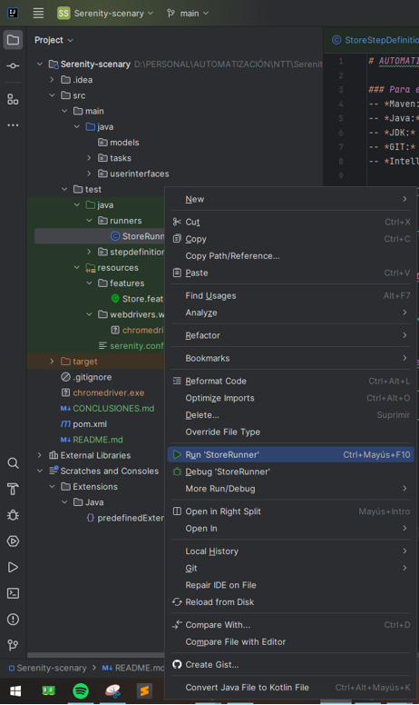

# AUTOMATIAZCIÓN WEB CON SERENITY BDD, SCREENPLAY Y CUCUMBER

### Para el proyecto es necesario tener en cuenta los siguientes requisitos:
-- *Maven:* En su versión 3.9.6  
-- *Java:* En su versión 17.0.2  
-- *JDK:* Se recomienda utilizar la versión 8  
-- *GIT:* Instalar git para poder utilizar la consola y clonar el repositorio  
-- *IntelliJ IDE:* Es el IDE utilizado para el desarrollo del presente proyecto.

### Clonar el repositorio con el siguiente comando en el bash de Git
```

  git clone https://github.com/Guillo7799/serenity-scenary.git

```
### Ejecutar el comando para construir el proyecto
```

  mvn package

```
### Para ejecutar las pruebas se debe ir a la siguiente ruta
```
-Serenity-scenary
    |-src
        |-test
            |-java
                |-runners
                    |-SoreRunner

```
1.- Hacer click derecho sobre el archivo: StoreRunner  
2.- Hacer click sobre Run 'StoreRunner'
